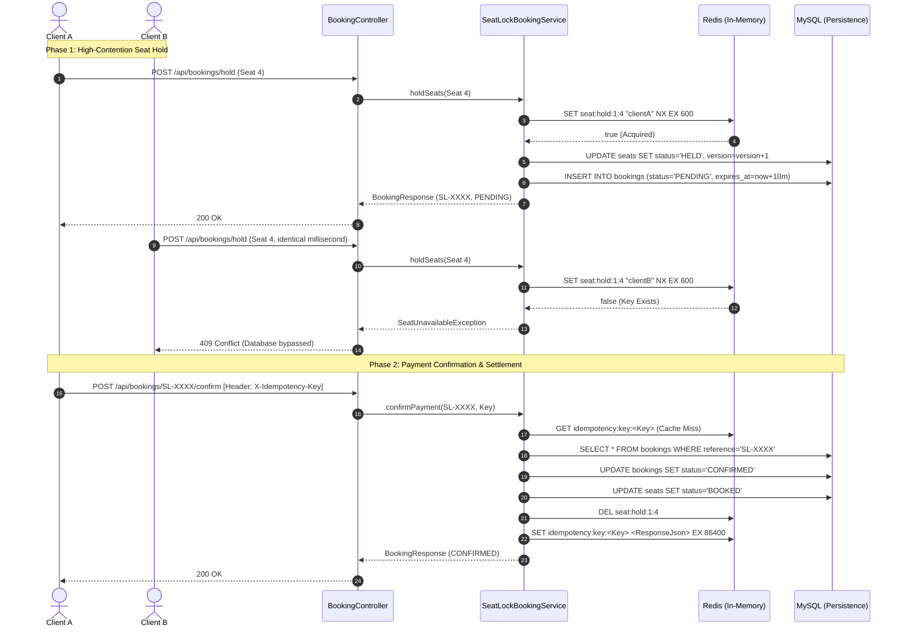

# SeatLock: High-Concurrency Seat Reservation Engine

SeatLock is a distributed seat reservation engine built with Java, Spring Boot, Redis, and MySQL. It addresses high-contention inventory allocation challenges typical in ticketing systems, flash sales, and reservation platforms where thousands of concurrent transactions contend for identical, limited resources.

---

## Architectural Objectives & Invariants

Under heavy contention (such as ticket drops or flash reservations), standard relational database transactions fail due to connection pool starvation, lock contention, or race conditions. SeatLock enforces four strict architectural invariants:

1. **Zero Double-Booking (Mutual Exclusion):** No individual seat can be reserved or held by more than one user at any given timestamp.
2. **Database Load Shedding (In-Memory Fast-Fail):** High-contention lock acquisition is decoupled from the relational database and handled entirely in-memory via Redis. Contending requests are rejected in sub-millisecond latency without generating database transaction overhead.
3. **Fault-Tolerant Reservation Lifecycle:** Seat holds automatically expire after a fixed duration (`booking.hold.minutes`) via cache TTL, accompanied by a relational reconciliation worker to clean stale database records.
4. **Idempotent Payment Settlement:** Duplicate payment confirmations resulting from network timeouts, client-side retries, or multiple clicks produce identical results without executing redundant side effects or generating errors.

---

## State Model

The engine operates on two coordinated state machines across MySQL and Redis:

### Seat State Machine
```
[AVAILABLE] ──(Hold Acquired: Redis NX)──> [HELD] ──(Payment Confirmed)──> [BOOKED]
     ▲                                       │
     │                                       │
     └────────(TTL Expiry / Scheduler)───────┘
```

### Booking State Machine
```
[PENDING] ──(Payment Confirmed)──> [CONFIRMED]
    │
    ├────(Timeout > Hold Window)──> [EXPIRED]
    │
    └────(Client Cancellation)────> [CANCELLED]
```

---

## Core Technical Components

### 1. In-Memory Distributed Locking (`SeatHoldService`)
Seat acquisition utilizes Redis's native atomic command `SET key value NX EX <ttl>` via `StringRedisTemplate.setIfAbsent()`.
* **Atomic Evaluation:** Lock existence check and TTL assignment occur in a single operation.
* **Compensating Rollback on Batch Requests:** If a client requests multiple seats (e.g., `A-1` and `A-2`) and any single seat fails acquisition, all previously acquired holds within that request are immediately evicted from Redis to prevent partial allocations and deadlocks.

### 2. Dual-Layer Concurrency Defense (`@Version` Optimistic Locking)
While Redis serves as the primary high-throughput traffic filter, MySQL entities maintain an `@Version` column. This provides defense-in-depth:
* Guarantees transactional isolation at the storage layer against edge cases such as Redis clock drift or network partitions.
* Protects against concurrent modifications between the payment confirmation thread and the background reconciliation scheduler.

### 3. Asynchronous Reconciliation Engine (`BookingExpirationScheduler`)
Redis handles TTL eviction in memory, but relational database state must remain synchronized:
* A scheduled worker executes periodically (`@Scheduled(fixedDelay = 60000)`).
* Queries expired pending bookings using an indexed composite lookup: `idx_booking_status_expires` on `(status, expires_at)`.
* Reverts associated seats to `AVAILABLE` and marks bookings as `EXPIRED`.
* Validates ownership before releasing seats to ensure no race condition with newer valid holds.

### 4. Idempotency Engine (`IdempotencyService`)
The payment confirmation endpoint accepts an optional `X-Idempotency-Key` header:
* Prior to executing database transactions, the key is queried in Redis (`idempotency:key:<key>`).
* On a cache hit, the previously serialized `BookingResponse` is returned immediately with HTTP 200.
* On a cache miss, the booking is confirmed, the response is persisted to Redis with a 24-hour TTL, and the client receives the generated response.

---

## Request Execution Flow



---

## Failure Mode Analysis & Mitigations

| Failure Mode | Naive Implementation Risk | SeatLock Architecture | Technical Mitigation |
| :--- | :--- | :--- | :--- |
| **Race Conditions** | Multiple threads read `status = AVAILABLE` simultaneously, leading to double-booked seats. | Mutual exclusion enforced prior to persistence. | Atomic Redis `setIfAbsent` combined with JPA `@Version` optimistic locking. |
| **Connection Starvation** | 10,000 requests acquire database connections and lock rows, exhausting the HikariCP pool. | Database connections are shielded by an in-memory barrier. | Contention is rejected at the Redis layer in $<1\text{ms}$; MySQL is never queried for losing threads. |
| **Abandoned Sessions** | Users reserve seats and close their browser, permanently locking inventory. | Automatic time-based inventory reclamation. | Redis TTL auto-eviction paired with an indexed background reconciliation worker (`BookingExpirationScheduler`). |
| **Duplicate Payments** | Network timeouts trigger automated client retries or double-clicks, creating duplicate charges. | Strict operational idempotency. | `X-Idempotency-Key` response caching with 24-hour retention window. |
| **Partial Batch Failures** | If seat 1 succeeds but seat 2 fails, seat 1 remains locked indefinitely. | All-or-nothing reservation semantics. | Compensating cleanup loop in `SeatHoldService` deletes previously acquired keys upon downstream failure. |

---

## Empirical Concurrency Benchmark

The architecture was evaluated under artificial contention using `RedisSeatLockConcurrencyTest`. The test suite initializes 50 worker threads behind a `CountDownLatch` barrier, releasing them simultaneously to contend for a single inventory resource (`Seat A-4`).

### Execution Summary
```text
================ CONCURRENCY TEST RESULTS ================
Total Concurrent Requests : 50
Successful Holds (Winner) : 1 (racer17@example.com)
Rejected Requests         : 49
Total Execution Time      : 852 ms
==========================================================
Total PENDING bookings in DB: 1
Process finished with exit code 0
```

### Observations
* **Throughput:** All 50 concurrent acquisition attempts resolved in 852 milliseconds total elapsed runtime.
* **Consistency:** Exactly 1 reservation record was created in the relational database.
* **Integrity:** 49 requests received immediate HTTP 409 Conflict rejections via Redis; zero deadlocks, connection timeouts, or optimistic locking exceptions were registered at the database level.

---

## API Specification

Interactive OpenAPI documentation is served at `/swagger-ui.html`.

### Endpoints

#### 1. Retrieve Show Inventory
```http
GET /api/shows/{showId}/seats
```
Returns all seats and their current availability statuses (`AVAILABLE`, `HELD`, `BOOKED`) for a given show.

#### 2. Acquire Temporary Seat Hold
```http
POST /api/bookings/hold
Content-Type: application/json

{
  "showId": 1,
  "seatIds": [1, 2],
  "userEmail": "customer@example.com"
}
```
* **Success Response (200 OK):**
```json
{
  "bookingReference": "SL-502BE3DF",
  "showTitle": "Coldplay: Music of the Spheres Tour 2026",
  "userEmail": "customer@example.com",
  "seatNumbers": ["A-1", "A-2"],
  "totalAmount": 500.00,
  "status": "PENDING",
  "expiresAt": "2026-10-03T12:18:34",
  "createdAt": "2026-10-03T12:08:34"
}
```
* **Error Response (409 Conflict):**
```json
{
  "timestamp": "2026-10-03T12:08:34",
  "status": 409,
  "error": "Conflict",
  "message": "One or more selected seats are currently held by another user. Please choose different seats."
}
```

#### 3. Confirm Booking & Process Settlement
```http
POST /api/bookings/{bookingReference}/confirm
X-Idempotency-Key: 7b3e94a8-9d41-4775-b4c2-9e5c464efc13
```
* **Success Response (200 OK):**
```json
{
  "bookingReference": "SL-502BE3DF",
  "showTitle": "Coldplay: Music of the Spheres Tour 2026",
  "userEmail": "customer@example.com",
  "seatNumbers": ["A-1", "A-2"],
  "totalAmount": 500.00,
  "status": "CONFIRMED",
  "expiresAt": "2026-10-03T12:18:34",
  "createdAt": "2026-10-03T12:08:34"
}
```

---

## Database Indexing Strategy

To guarantee high-throughput query execution during scheduled reconciliation and seat queries, the following structural constraints and indexes are established:

* `seats (show_id, seat_number)`: `UNIQUE` constraint preventing duplicate seat declarations per event.
* `bookings (status, expires_at)`: Composite B-Tree index (`idx_booking_status_expires`) enabling logarithmic range scans for expired pending bookings during periodic cleanup.
* `bookings (booking_reference)`: `UNIQUE` index supporting constant-time settlement lookups.

---

## Local Development & Setup

### Prerequisites
* JDK 21 or higher
* MySQL 8.0+
* Redis 7.0+
* Maven 3.8+

### Configuration
Verify local connection properties in `src/main/resources/application.properties`:
```properties
spring.datasource.url=jdbc:mysql://localhost:3306/seatlock_db
spring.datasource.username=devil
spring.datasource.password=password

spring.data.redis.host=localhost
spring.data.redis.port=6379

booking.hold.minutes=10
```

### Build and Execution
```bash
# 1. Start backend dependencies
sudo systemctl start mysql
sudo systemctl start redis-server

# 2. Compile and package
./mvnw clean package

# 3. Execute test suite (including concurrency tests)
./mvnw test

# 4. Run application
./mvnw spring-boot:run
```

API documentation is accessible at:
`http://localhost:8080/swagger-ui.html`
